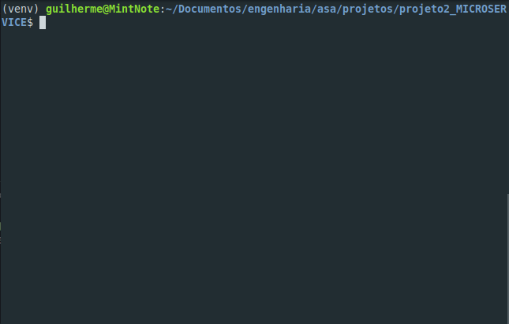

## MICROSERVICE

# Executando o serviço
<p align="center">
    
</p>

# Estrutura do nosso banco de dados
<p align="center">
  
</p>

* Exemplo de requisição para obter um objeto.
```json
{
  "class": "categorias",
  "data": {
    "id_categoria": 589,
    "tituloCategoria": "TUBOLACAO",
    "descricaoCategoria": "TUBO ALUMINIO 3X4MM DECA",
    "fg_ativo": 1
  }
}
```

* Exemplo de requisição para inserir um objeto
